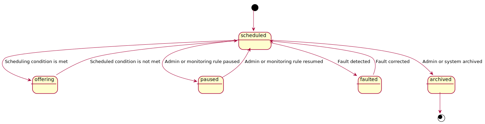
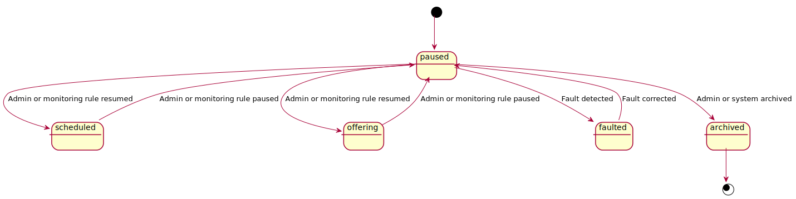

# Deployments in the Windows Update for Business deployment service

Deployments are the foundation of the Windows Update for Business deployment service. Through a deployment you can target a set of devices to receive a specific content offer such as a [software update](windowsupdates-software-updates.md).

Deployments have the following key aspects:

1. Content: The content discovered in the catalog to deploy.
2. Audience: The devices to receive content.
3. Settings: Settings governing the rollout of content to devices and other configuration.
4. State: The current state of the deployment within its lifecycle.

## Create a deployment

Because content and audience are key to the definition of a deployment, both are required to be assigned at the time of creation. That assignment cannot be changed later, however, device membership within an audience can.

To learn more about creating a deployment, see [Deploy an update using the Windows Update for Business deployment service](windowsupdates-deploy-update.md).

## Configure settings

### Rollout

Rollout settings govern how the content is rolled out or offered. This provides control over whether all devices receive offers at the same time, gradually in sets, or beginning on a particular date and time.

To learn more, see [Schedule a deployment using the Windows Update for Business deployment service](windowsupdates-schedule-deployment.md).

### Monitoring

You can use monitoring settings to configure alerts and automated actions to take based on deployment signals.

To learn more, see [Manage monitoring rules for a deployment using the Windows Update for Business deployment service](windowsupdates-manage-monitoring-rules.md).

## Get or set lifecycle state

### States

Deployments move through the following lifecycle states.

| Value     | Description                                                                                                           |
|-----------|-----------------------------------------------------------------------------------------------------------------------|
| scheduled | Waiting for offer conditions to be met to start or continue offering the deployment.                                  |
| offering  | The deployment is offering updates to devices.                                                                        |
| paused    | The deployment is paused and prevented from offering updates to devices until an admin or monitoring rule resumes it. |
| faulted   | The deployment is faulted and cannot offer updates to devices until the fault is resolved.                            |
| archived  | The deployment is ended and archived by the admin and cannot offer updates again.                                     |

### Resources

The `state` property of the [deployment](/graph/api/resources/windowsupdates-deployment?view=graph-rest-1.0) resource provides information about the current lifecycle state.

This property is a [deploymentState](/graph/api/resources/windowsupdates-deploymentstate?view=graph-rest-1.0) resource and includes additional properties for inspecting the current state of the deployment or requesting a new state.

| Property       | Type                                                                                                              | Description                                                                                                                      |
|:---------------|:------------------------------------------------------------------------------------------------------------------|:---------------------------------------------------------------------------------------------------------------------------------|
| value          | deploymentStateValue                                                                                              | Specifies the state of the deployment. Read-only. Possible values are: `scheduled`, `offering`, `paused`, `archived`, `faulted`. |
| reasons        | [deploymentStateReason](/graph/api/resources/windowsupdates-deploymentstatereason?view=graph-rest-1.0) collection | Specifies the reasons the deployment has its state value. Read-only.                                                             |
| requestedValue | requestedDeploymentStateValue                                                                                     | Specifies the requested state of the deployment. Possible values are: `none`, `paused`, `archived`.                              |

### State transitions

#### Scheduled

#### Offering

#### Paused

#### Faulted

#### Archived

#### All

### Example scenario

| Description of action                     | requestedValue | Resulting value | Resulting reasons                                   |
|-------------------------------------------|----------------|-----------------|-----------------------------------------------------|
| Deployment is created in paused state     | Paused         | Paused          | pausedByRequest                                     |
| Admin takes away pause intent             | None           | Scheduled       | scheduledByOfferWindow, scheduledByLinkedDeployment |
| Linked deployment criteria is met         | None           | Scheduled       | scheduledByOfferWindow                              |
| Offering window criteria is met           | None           | Offering        | offeringByRequest                                   |
| Offering window criteria is no longer met | None           | Scheduled       | scheduledByOfferWindow                              |
| Admin pauses deployment                   | Paused         | Paused          | pausedByRequest                                     |
| Admin takes away pause intent             | None           | Offering        | offeringByRequest                                   |
| Monitoring rule threshold exceeded        | None           | Paused          | pausedByMonitoring                                  |
| Admin disables monitoring rule            | None           | Offering        | offeringByRequest                                   |
| Monitoring rule threshold is exceeded     | None           | Paused          | pausedByMonitoring                                  |
| Another monitoring rule triggers unpause  | None           | Offering        | offeringByRequest                                   |
| Admin pauses deployment                   | Paused         | Paused          | pausedByRequest                                     |
| Admin changes graph settings              | Paused         | Faulted         | faultedBySettingsIncompatibility                    |
| Admin fixes fault issue                   | Paused         | Paused          | pausedByRequest                                     |
| Monitoring rule threshold exceeded        | Paused         | Paused          | pausedByMonitoring, pausedByRequest                 |
| Admin takes away pause intent             | None           | Paused          | pausedByMonitoring                                  |
| Admin archives deployment                 | Archived       | Archived        | archivedByRequest                                   |

## Supersedence behaviors

Supersedence behaviors simplify your experience with multiple revisions of content by resolving potential conflicts according to best match rules.

This facilitates reaching newly scheduled deployment goals without requiring you to continually revisit past decisions.

### Scenarios

1. For a given device you can schedule a deployment for a newer piece of content while the deployment for an older piece of content is ongoing.

    *One device can be scheduled for two pieces of content in sequence. For example, a deployment for Windows 10, version 1909 can be scheduled for a device while the deployment for Windows 10, version 1903 is not yet complete.*

2. You can approve newer content for a device without needing to revoke approval on older content.

    *If two pieces of content are available to a device, the newer content supersedes the older. For example, a deployment for Cummulative Update 5B can be approved for a device without changing the approval for Cummulative Update 4B.*

3. You can deploy multiple pieces of content for a device and the device automatically meets the conditions of both deployments.

    *If two pieces of content are available to a device, the newer content supersedes the older. For example, if a device is a member of a deployment for Windows 10, version 1903 and a deployment for Windows 10, version 1909, it will receive Windows 10, version 1909.*

Support for these scenarios become especially useful when deployments are spread over time and when overlapping.

### Rules

1. Available content is prioritized over scheduled content (i.e. `offering` over `scheduled`).
2. Higher ranked (typically newer) content is prioritized over lower ranked (typically older) content.

### Logic

- If a device is in two deployments where both are `scheduled`, wait until one reaches `offering`.
- If a device is in two deployments where only one has content that is `offering`, offer the available content.
  - If the other (scheduled) content is equivalent or older, also cancel (supersede) it.
  - If the other (scheduled) content is newer, keep it scheduled so that it eventually will be `offering`.
- If a device is in two deployments where both have content that is `offering`, offer the newer content and cancel (supersede) the deployment session with the older content.

### Scope

- Supersedence applies only to content. After content is resolved by supersedence logic, there may be additional conflicts that affect deployment outcomes. For example, if a device is a member of two deployments of the same Expedited Quality Update but with different User Experience Settings, there is no content conflict between the two because both deployments apply to the latest applicable update for the device. However, that update will not be expedited until the settings conflict is explicitly resolved (i.e. the update will be offered normally until the conflict is resolved).
- Supersedence relies on customer intent being properly expressed; it is not meant to infer customer intent based on observed behavior. For example, if a customer approved Windows 10, version 1903 and then changed their mind to approve Windows 10, version 1809 instead, the removal of approval for Windows 10, version 1903 must be communicated to the service.

### Examples

#### A newer update is approved

##### After the older update is complete

| Description of action/change                          | Service sends                                             | Customer sees     |
|-------------------------------------------------------|-----------------------------------------------------------|-------------------|
| Device is added to a deployment for content A         | Scheduled for A                                           | Scheduled for A   |
| Device is offered content A                           | Offer ready for A                                         | Offer ready for A |
| Content A is installing                               |                                                           | Installing for A  |
| Content A is installed                                |                                                           | Installed for A   |
| Device is added to a deployment for content B (B > A) | Scheduled for B [possible alert that A may be superseded] | Scheduled for B   |
| Device is offered content B                           | Superseded (service cancelled) for A, Offer ready for B   | Offer ready for B |
| Content B is installing                               |                                                           | Installing for B  |
| Content B is installed                                |                                                           | Installed for B   |

##### Before the older update is complete

| Description of action/change                          | Service sends                                             | Customer sees                      |
|-------------------------------------------------------|-----------------------------------------------------------|------------------------------------|
| Device is added to a deployment for content A         | Scheduled for A                                           | Scheduled for A                    |
| Device is offered content A                           | Offer ready for A                                         | Offer ready for A                  |
| Device is added to a deployment for content B (B > A) | Scheduled for B [possible alert that A may be superseded] | Offer ready for A, Scheduled for B |
| Device is offered content B                           | Superseded (service cancelled) for A, Offer ready for B   | Cancelled for A, Offer ready for B |

#### Device already satisfies intent of deployment of older update

This case is similar to a device already having newer content than the approved content.

| Description of action/change                          | Service sends                        | Customer sees                      |
|-------------------------------------------------------|--------------------------------------|------------------------------------|
| Device is added to a deployment for content B         | Scheduled for B                      | Scheduled for B                    |
| Device is offered content B                           | Offer ready for B                    | Offer ready for B                  |
| Device is added to a deployment for content A (A < B) | Superseded (service cancelled) for A | Cancelled for A, Offer ready for B |
| Content B is installing                               |                                      | Installing for B                   |
| Content B is installed                                |                                      | Installed for B                    |

#### Sequential updates are scheduled in advance

**Overlapping rollouts**: A phased deployment is planned to take longer than the time between content approvals. A device that is at the end of the phased deployment should not be in any conflict state due to being in two deployments. It is okay for the device to be scheduled for two pieces of content; it is okay for the device to be scheduled for a piece of content while receiving another piece of content. Once newer content is available (offer ready), it supersedes older content.

| Description of action/change                          | Service sends                                                 | Customer sees                      |
|-------------------------------------------------------|---------------------------------------------------------------|------------------------------------|
| Device is added to a deployment for content A         | Scheduled for A                                               | Scheduled for A                    |
| Device is added to a deployment for content B (B > A) | Scheduled for B [possible alert that first to offer will win] | Scheduled for A, Scheduled for B   |
| [optional] Device is offered content A                | Offer ready for A                                             | Offer ready for A, Scheduled for B |
| Device is offered content B                           | Offer ready for B, Superseded (service cancelled) for A       | Cancelled for A, Offer ready for B |

#### Same update is scheduled for different times

| Description of action/change                        | Service sends                                                                               | Customer sees     |
|-----------------------------------------------------|---------------------------------------------------------------------------------------------|-------------------|
| Device is added to deployment 1 for content A       | Scheduled for A for deployment 1                                                            | Scheduled for A   |
| Device is added to deployment 2 for content A       | Scheduled for A for deployment 2 [possible alert that device will get at first opportunity] | Scheduled for A   |
| Device is offered content A because of deployment 1 | Offer ready for A for deployment 1, Superseded (service cancelled) for A for deployment 2   | Offer ready for A |
| Content A is installing                             |                                                                                             | Installing for A  |
| Content A is installed                              |                                                                                             | Installed for A   |